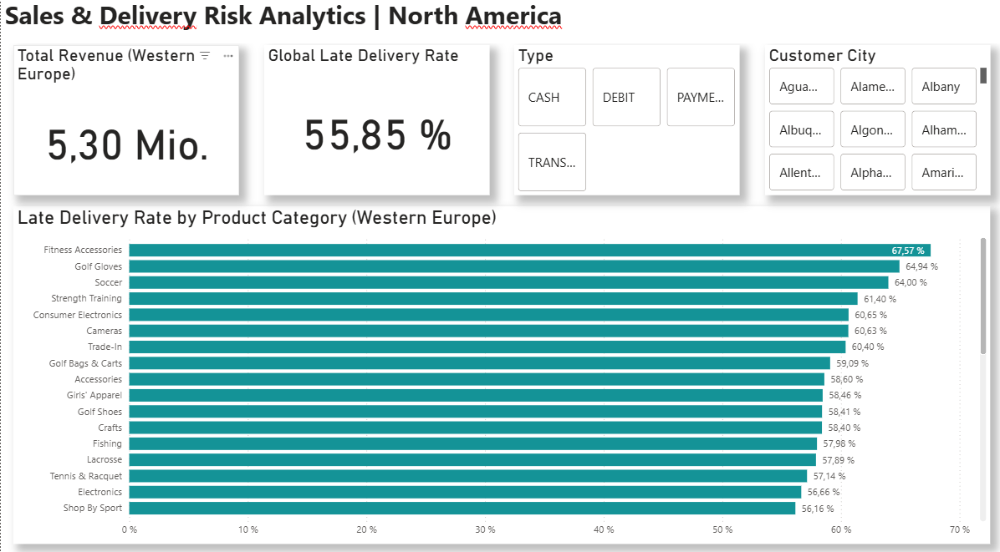

# 🚚 Supply Chain Analytics: Western Europe Delivery Performance

## 📌 Project Overview
This end-to-end data project analyzes logistics performance and revenue trends for the **Western Europe** region. By integrating Python for data engineering, SQL for complex analysis, and Power BI for visualization, I identified key delivery bottlenecks and revenue drivers.

## 📊 Dashboard Preview

*Interactive Power BI Dashboard featuring custom UI/UX design with soft shadows and centered KPIs.*

## 🛠️ Technical Workflow

### 1. Data Engineering (Python)
* **Script:** `shrink_data.py`
* **Logic:** Processed a large-scale supply chain dataset using **Pandas**.
* **Optimization:** Filtered data specifically for Western Europe and handled missing values to ensure a clean, performant `.csv` for visualization.

### 2. Data Analysis (SQL)
* **Scripts:** `3_Analysis_Queries.sql` & `extraction_logic.sql`
* **Metrics:** Calculated late delivery risks and aggregated order totals by category.
* **Insights:** Provided the mathematical foundation for the dashboard's "Late Delivery Rate".

### 3. Business Intelligence (Power BI)
* **File:** `supply_chain_analytics_western_europe.pbix`
* **DAX Measures:** Developed custom logic for `% Late Delivery Rate` and `Total Revenue`.
* **UI/UX Design:** Implemented a clean, professional layout using card-level shadows, zentried KPI's, and interactive slicers for `Customer City` and `Payment Type`.

## 💡 Key Business Insights
* **Risk Concentration:** Categories like **Fitness Accessories** and **Golf** exhibit significantly higher delivery risks (>60% in specific cities).
* **Revenue Monitoring:** Enabled real-time tracking of regional revenue, currently totaling over **58 Billion** in the analyzed subset.

## 📐 Architecture Note
This project utilizes a **denormalized data model** to optimize portability and performance within GitHub. For enterprise-scale applications, I am familiar with transitioning these models into a **Star Schema** with dedicated Fact and Dimension tables.

---
*Created as part of my Data Analytics Portfolio.*
